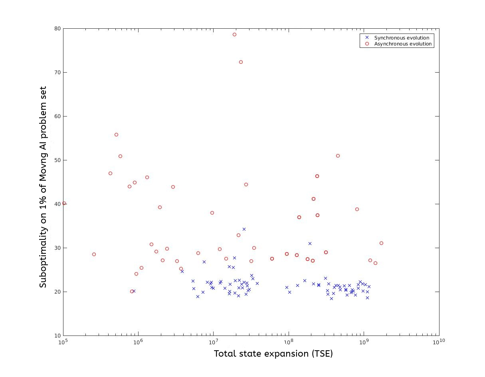

#  Searching for Real-time Heuristic Search Agents using Asynchronous Evolution

This project uses asynchronous evolutionary algorithm to search for the optimal Real-time heuristic search algorithm.

The project first breaks down the Extended LRTA* real time heuristic algorithm into building blocks where each block has its own parameter.

The project then runs and asynchronous evolution to find the best parameter combination from all possible parameter combinations.

Finally the project uses suboptimality to evaluate the quality of a search algorithm.

